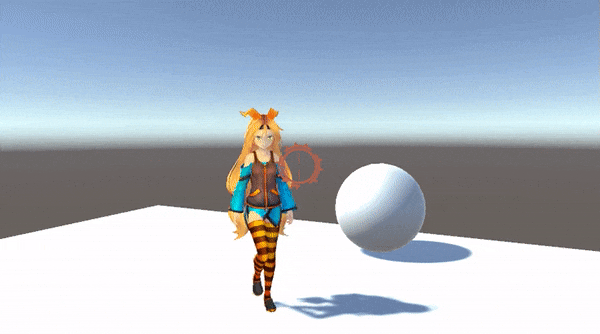

# RagdollBlendToAnimator

A simple protype to interpolate between ragdoll and animation. One use is to make projectile-like objects that can push players around a bit.

Only work with humanoid animators.

It has two modes, with adjusting position and rotation when blending back to animation according to forward of the ragdoll or without adjust the position and rotation is the same of the current root of the animator. See gifs to see differences.

No adjust

  

With adjust

 

## License
The MIT License (MIT) 
Copyright (c) 2023 Arkms
